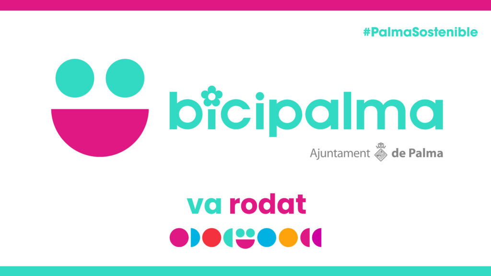

# BiciPalma

This repository is a preparation exercise for the 2 Trimester 1 DAW Intensive exam, which was set to be solved in 2014, with the objective of using static arrays in Java and getting familiar with this new language. 

## Documentation Provided

Below I leave the information provided by the teacher about the exam to be done, I also leave a link to the teacher's repository with the exercise solved by him.

### Notes

In this first simulation, which was a 2014 test, we are going to build a prototype of the application that manages a station where the bicycles of the BiciPalma service are anchored. 

* Arrays estáticos
* Tipos primitivos
* loops
* SRP
* OCP
* Tiene una /has-a
* Composición (agregación fuerte)
* TDD :(
* Refactorización
* Gradle sourceSets

### DDD

### Repository Help

[dfleta](https://github.com/dfleta/bicipalma-streams-jacoco)
